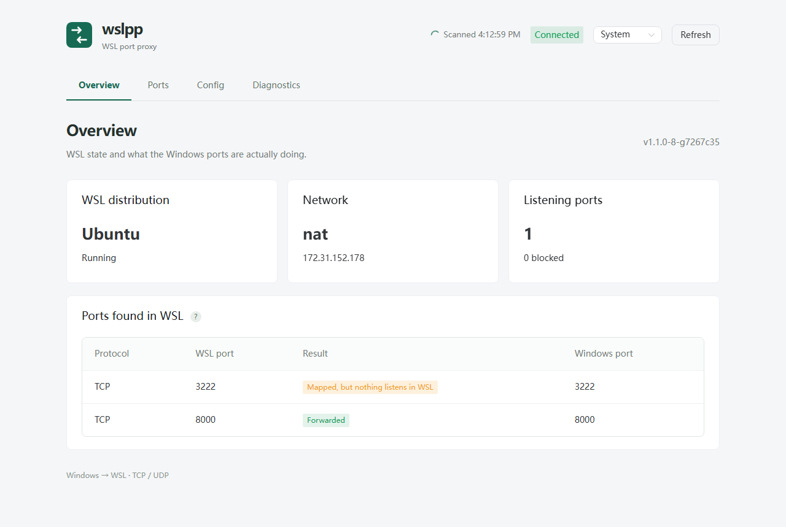

# wsl2-auto-portProxy
wsl2-auto-portProxy(wslpp) is a simple tool for proxying port of linux running in wsl2 (which now use a hyper-v nat network), it automatically scans the port in wls and setup a port proxy in windows host.    

**Note: only port listening at [::] or 0.0.0.0 works, and will only works to  your default  wsl distribution (or the one set by `distro`)**



## Feature
- [x] TCP port support
- [x] custom port proxy config, support live edit
- [x] client IP allowlist per port
- [x] web interface (English / 中文 / 日本語)
- [x] UDP port support (opt-in)
- [x] start with Windows in the background (no password needed)


## Requirement
~~your wsl linux must install the `net-tools` by~~ 
```bash
# deprecated !!!, not needed anymore
sudo apt-get install net-tools
```
**Note: `net-tools` is not required anymore, use `iproute2` instead 
(which is preinstalled by default in many linux distribution)**, 
see [Why is net-tools deprecated](https://unix.stackexchange.com/questions/677763/why-is-net-tools-deprecated-can-i-still-use-it-without-security-issue)


## Download and install
Download `wslpp_<version>_windows_amd64.zip` (or `arm64`) from [release](https://github.com/HobaiRiku/wsl2-auto-portproxy/releases), unzip it, and run:
```powershell
.\wslpp.exe
```
Then open the web interface at http://127.0.0.1:47831/ (or run `.\wslpp.exe ui`). It only listens on 127.0.0.1, so no login is needed.

#### Start with Windows
To keep wslpp running in the background and start it with Windows:
```powershell
.\wslpp.exe install    # asks for UAC once; no password
.\wslpp.exe status
.\wslpp.exe stop       # stays stopped, also after a reboot, until start
.\wslpp.exe start
.\wslpp.exe uninstall  # keeps config and logs
```
`install` registers a scheduled task that runs wslpp as your Windows account from boot, without a window and without storing your password. It runs as you because WSL distributions belong to the user who installed them. If wslpp exits, the task starts it again within 5 minutes. It also adds a Windows Firewall rule so other devices can reach the forwarded ports.

wslpp copies itself to `%ProgramData%\wslpp\bin` and keeps its data in `%ProgramData%\wslpp\data`. To upgrade, run `.\wslpp.exe update` from the new version.

`.\wslpp.exe install --service` installs a Windows service instead. A service must store your account password: for a Microsoft account that is its online password, a Windows Hello PIN does not work.

**Note: background mode is new; please report issues if it does not start or cannot see your distribution.**

#### or build wslpp.exe from source
Requires Go, Node.js 22+ (with corepack) and GNU make:
```bash
make build
```
the bin file will be store in build/bin/wslpp.exe, with the web interface embedded

## How it works
wslpp start an interval (every 2 seconds) to get IP address of the nat interface and scan all ports listening at all network in the subsystem, then use golang's `net` to start proxy direct to ports.

When wsl is not running, wslpp stops all proxies and waits, it only checks the state by `wsl --list` and won't boot wsl again by itself.

## Configuration
Support custom configuration by a json file, placed in `%HOMEPATH%/.wslpp/config.json` (`%ProgramData%\wslpp\data\config.json` once installed). It can also be edited in the web interface, with a form or as JSON.    
Example:
```json
{
  "onlyPredefined": true,
  "predefined": {
    "tcp": [
      "666:22"
    ]
  },
  "ignore": {
    "tcp": [
      445
    ]
  },
  "allowlist": {
    "tcp": {
      "666": ["192.168.1.0/24", "10.0.0.5"]
    }
  },
  "udpEnabled": false
}
```
* onlyPredefined: If `true`, will only start port defined in `predefined` field.
* predefined: Define the custom port to proxy, "666:22" means `windows(666)->linux(22)`, if undefined, port in windows will follow the same of linux. Must be a string array in the sub field name `tcp`.
* ignore: If defined, will ignore the port in linux. Must be a number array in the sub field name `tcp`. 
* allowlist: If defined, only clients from the listed IPs or CIDR ranges can connect to that port, others are disconnected immediately. Keys are the **windows** listen ports (`666` in the example above, not `22`), ports not listed are open to everyone. Clients on loopback (the windows host itself) are always allowed. Must be an object in the sub field name `tcp`.
* udp: `predefined`, `ignore` and `allowlist` also accept a `udp` field. UDP is only forwarded when `udpEnabled` is `true`.
* distro: Optional WSL distribution name, e.g. `"distro": "Ubuntu"`. If undefined, the default WSL distribution is used.

**Note: If the config file is invalid when wslpp starts, no proxy is started until it is fixed; an invalid edit later keeps the last valid config.**

**Note: If port is already use by another program in windows, the port is shown as blocked and retried later**

## About `wslhost.exe`
Now Microsoft will forward ports in linux by `wslhost.exe` when `.wslconfig` includes `localhostForwarding=true` (which is ture by default), see [wsl-config](https://learn.microsoft.com/en-us/windows/wsl/wsl-config). But, all those ports will only listen at local network on windows host, which means you can't access them from other devices in the same network. 
For now, `wslpp` will still open a same port listening at all interfaces, but if you don't need network access at this, you probably don't need `wslpp` at all, `wslhost.exe` is enough.
## Another solution for wsl2 port forwarding - `WSLHostPatcher` 
Fond a way to inject `wslhost.exe` to forward ports to all interfaces, 
[WSLHostPatcher](https://github.com/CzBiX/WSLHostPatcher).    
By `WSLHostPatcher` you can forward ports to all interfaces by `wslhost.exe` more gracefully and efficiently.

## Security issue
It is unsafe to open ports in windows host to the internet (maybe the main reason why wslhost.exe don't do this), so when start port at all interfaces, be sure you know what you are doing.

## Design notes
See [docs/design](docs/design) for the rearchitecture plan and implementation status.

## License
MIT

