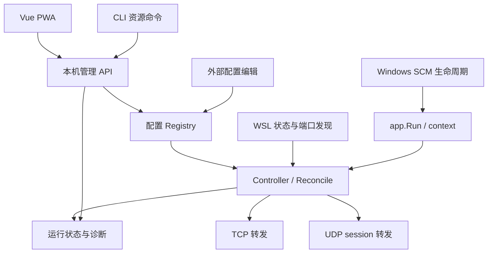

# wslpp 调研与重构计划

调查日期：2026-10-08。范围：调查、设计与实施计划；本次没有修改程序实现或补入正式测试。

执行更新（2026-10-08）：用户已授权实施，要求先创建独立分支、单独提交本计划，再首先搭建 UI 框架和简单页面。实际执行先交付 Vue/TypeScript/PWA 骨架，再推进 A–E 并接入页面；具体 UI 设计和框架更改后续独立进行。以下调研内容保留作为实施基线。

## 1. 建议与已确认范围

建议先把行为契约和状态协调做正确，再替换代理内核，最后接入服务安装与 PWA。核心方案以 Go `net` 上的小型 TCP/UDP 内核为当前推荐，GOST 为统一框架验证候选；最终选型以 Windows 上的同一套行为测试决定，不凭功能清单或吞吐宣传决定。

用户已确认：

- 必须作为 Windows SCM 系统服务，在用户未登录时运行。服务注册范围和运行账户是两个概念：系统级注册可以使用拥有 WSL 发行版的 Windows 用户账户。
- 首版继续围绕默认 WSL2 发行版、NAT 网络；需要识别 mirrored 模式。多发行版同时管理暂不进入首版。
- 本轮只调查和计划，测试补充、重构、UI 实现留到后续阶段。

保留已有兼容行为：`666:22` 映射、ignore、onlyPredefined、按 Windows 监听端口配置 allowlist、loopback 绕过 allowlist、无效配置编辑保留最后有效配置、WSL 停止后不因轮询将其启动。新配置不能默默扩大旧配置的开放范围。

服务开机启动不等于自动启动 WSL。暂按保留现有“不自动唤醒 WSL”行为设计：服务可先进入 waiting 状态。若需要无人登录时同时启动 WSL，应增加明确的 opt-in 策略，并单独验证启动、关闭及停止后是否重启的语义。

## 2. 实际检查与测试基线

检查版本：

| 工程 | 检查的 commit | 用途 |
| --- | --- | --- |
| [wsl2-auto-portproxy](https://github.com/HobaiRiku/wsl2-auto-portproxy) | `42f8fcafc530153bee07a9855bd957826826c4d0` | 当前待重构实现 |
| [ssh-tunnel-service](https://github.com/HobaiRiku/ssh-tunnel-service) | `5f093d37f011adc719a5e9426825e8dda36dbd16` | 服务、状态管理、CLI/API、Vue PWA 参考 |
| [inetaf/tcpproxy](https://github.com/inetaf/tcpproxy) | `c159a60511096e475e3489ce13ae57e752c78f99` | 轻量 TCP 代理及半关闭参考 |
| [go-gost/x](https://github.com/go-gost/x) | `640e239280774c069c36eab6214ac25d2ae2a412` | 统一 TCP/UDP 框架源码调查 |

在 Linux 调查环境临时安装 Go 1.24.13 后运行：

```text
go test -race -coverprofile=<临时文件> ./...  PASS
go vet ./...                              PASS
GOOS=windows GOARCH=amd64 CGO_ENABLED=0 go build  PASS
```

现有 11 个 Test 函数全部通过，总语句覆盖率 34.1%；config 54.1%、proxy 88.2%、service 26.0%。`main`、配置文件加载、WSL 命令执行、端口发现及端口冲突计算没有覆盖。proxy 的高覆盖率没有验证半关闭和停止时的连接收尾。

另写了工作区之外的临时探针，实际复现：

| 行为 | 当前结果 | 位置 |
| --- | --- | --- |
| 配置映射为 `"22"` | 数组越界 panic | `lib/config/config.go:39` |
| `"70000:22"` / `"666:22:80"` | 越界端口、额外字段均被接受 | 同上 |
| 映射 `666→22`，Windows 22 被占用 | 错误排除该映射 | `lib/service/service.go:96` |
| 映射 `666→22`，Windows 666 被占用 | 错误认为可启动 | 同上 |
| Windows UDP 22 被占用，候选为 TCP 22 | 错误排除 TCP | 同上 |
| 客户端发送请求后 CloseWrite，后端读到 EOF 才返回响应 | 客户端得到空响应 | `lib/proxy/proxy.go:80` |
| 已建立连接后调用 Stop，再发送数据 | 连接继续正常转发 | `lib/proxy/proxy.go:50` |

以下是源码确认或推断，尚未在原生 Windows 复现：

- `Proxy.Type` 没有参与启动分派，Start 总是创建 TCP listener；UDP 只有部分配置字段与发现解析，没有数据转发实现。
- Linux 端口去重只使用端口数字；同端口 TCP/UDP 会相互覆盖。正则只接受 2–5 位端口，漏掉 1–9。
- Windows `netstat | findstr LISTENING` 不适合作为 UDP 发现手段；预扫描与实际 bind 之间也存在竞争。
- 部分映射变更可能需要两个轮询周期才能收敛；运行池身份不能完整表达协议、监听地址与目标变化。
- accept 循环意外退出不会同步修正 IsRunning；Stop 不提供幂等、等待连接退出、取消拨号的契约。
- `exec.Command` 没有 context 超时；一次挂起可阻塞整个发现与协调过程。
- WSL IP 解析依赖 eth0、bash、grep 和宽松正则；不适合直接用于 mirrored 网络。
- 非零 `wsl --list` 退出码被一概解释为没有运行的发行版，真实故障可能被误判为 stopped。
- 包级配置 init 会访问真实用户目录并可能终止进程，不利于测试和 SCM 部署。

这些发现需要区分“旧行为应保留”与“缺陷应修正”。不能把当前错误输出固化为期望值。

## 3. TCP/UDP 库的调查结论

| 方案 | TCP / UDP | Windows 与集成代价 | 当前判断 |
| --- | --- | --- | --- |
| Go 标准库 `net` | 原语齐全；需实现转发及 UDP session | 生命周期、缓冲和策略可明确控制；没有额外代理进程 | 当前推荐，适合本工具的固定目标转发 |
| GOST v3 `core` + `x` | 两者均支持；同一套 listener/handler/service 抽象 | 有 Windows 发布与可组合公开包；全局注册和依赖较多 | 最优先验证的统一框架候选 |
| `github.com/inetaf/tcpproxy` | TCP；没有 UDP | 静态路由简单，半关闭已实现；仍需外部管理连接与关闭 | 可作为 TCP 候选及设计参考 |
| Caddy layer4 | TCP / UDP | 必须接入 Caddy app/module 生命周期；项目自称 experimental | 对本工具集成范围偏大，暂不选 |
| gnet | TCP / UDP | 官方明确不建议 Windows 版本用于生产 | 排除本项目生产选型 |

依据：[GOST 转发说明](https://v3.gost.run/en/tutorials/port-forwarding/)、[GOST UDP listener](https://v3.gost.run/en/reference/listeners/udp/)、[tcpproxy](https://github.com/inetaf/tcpproxy)、[Caddy layer4](https://github.com/mholt/caddy-l4)、[gnet Windows 限制](https://github.com/panjf2000/gnet#-features)。

### 为什么不直接把 GOST 换进去

检查的 `x` HEAD 要求 Go 1.26.3，go.mod 包含大量代理协议相关依赖。按需导入可能减少实际链接的代码，因此不能把 go.mod 条目数直接当成最终二进制成本；需要测最小适配后的模块图、大小和启动资源。

源码还显示以下必须验证的语义：

- `listener/udp/metadata.go` 当前默认读取缓冲是 4096、队列 128、TTL 5 秒；与在线文档展示的默认值可能不同。必须锁定实际版本，并明确设置参数。
- UDP listener 默认 `keepalive=false`，session 写回后会关闭；通用 UDP 长会话需验证 keepalive、过期和源端口稳定性，不能只做 DNS 单次请求测试。
- `internal/net/pipe.go` 半关闭等待时间写死为 10 秒；Read 返回 `n>0` 同时带 EOF/error 时，当前控制流先处理 error，有丢弃最后一段数据的风险；写入数量也未显式校验。这是源码发现，尚未做该库的运行时复现。
- `service.Service.Close()` 与 Serve 返回不是同一个事件；Serve 中 defer 的等待先于 context cancel 执行。活跃连接关闭、handler 取消和截止时间必须由适配层验证，不能直接假设关闭 listener 就代表全部退出。
- UDP session 内核位于 Go `internal` 包，wslpp 不能直接导入。可通过公开的 UDP listener 使用，不能设计成直接复用内部 pool。

对应源码：[UDP 参数](https://github.com/go-gost/x/blob/640e239280774c069c36eab6214ac25d2ae2a412/listener/udp/metadata.go)、[UDP session](https://github.com/go-gost/x/blob/640e239280774c069c36eab6214ac25d2ae2a412/internal/net/udp/listener.go)、[Pipe](https://github.com/go-gost/x/blob/640e239280774c069c36eab6214ac25d2ae2a412/internal/net/pipe.go)、[service](https://github.com/go-gost/x/blob/640e239280774c069c36eab6214ac25d2ae2a412/service/service.go)。

### 选型的决策门槛

用同一套协议行为测试比较最小 GOST 适配与 `net` 方案。GOST 只有在能通过半关闭、完整报文、多客户端隔离、取消与有界退出、资源限制、Windows bind/WSL 测试，并且适配比维护小内核更简单时才采用。

若需要 fork、接管其内部 session、维护两套状态或引入独立 gost 进程才能实现核心契约，则选择 `net` 小内核。统一的是规则、策略、状态和生命周期；TCP 的字节流与 UDP 的报文语义分别实现。首版只保留最终选中的一种后端，不开发插件系统。

## 4. 核心架构与实现取向



建议目录：`cmd/`、`internal/app`、`internal/config`、`internal/wsl`、`internal/controller`、`internal/proxy`、`internal/api`、`internal/windowsservice`、`internal/web`、`ui/`。初期按真实职责拆分；不用为了每个结构体或接口建立一层包。

主要约束：

- `main` 只负责装配和退出；`app.Run(ctx, options)` 同时服务前台与 SCM。移除 storage 中的可变全局状态和有副作用的 init。
- 配置 Registry 是唯一写入口。CLI 和 UI 通过运行中的 API 修改；外部文件变更也经过同一验证与发布步骤。
- Discovery 输出不可变快照，明确区分 stopped、running、unknown/error。执行器、时钟和传输启动是测试边界；避免把所有标准库函数都包装成接口。
- 先用纯函数从 config + discovery 计算 desired routes，再由单个 Controller 顺序协调实际资源。UI 不从日志或端口列表猜状态。
- 监听资源身份包含协议、地址族、Windows 监听地址与端口。目标签名包含发行版、WSL 地址与远端端口；TCP/UDP 同数字端口可以共存。
- bind 才是冲突的最终依据。Windows 端口/PID 查询用于诊断，不再以 netstat 结果决定是否启动。管理 API 端口也是受保护的资源。
- unchanged route 不重启。相同监听端点更换目标时优先保留 listener、原子替换新连接的目标快照；UDP 清除旧目标 session。WSL 停止、规则删除、显式 Stop、旧 IP 失效时关闭相应活跃资源。
- 普通配置变更可让旧 TCP 连接有限期排空；收紧 allowlist 则重查并终止已不允许的 TCP/UDP session。不能仅更新新连接检查。
- 失败配置不发布；无有效首份配置时不打开代理，但管理 UI 可以运行并显示错误。文件突然消失不能悄悄回退到“开放所有端口”。
- 发现瞬时失败保留最后快照并显示 stale；超过有限宽限期后暂停旧目标代理。成功空结果与发现失败严格区分。默认宽限时间在验证阶段确定。
- 端口冲突记录为 blocked，并按有界退避重试；scan 与 reconcile 不创建重叠循环。用户暂停自动规则后，下一轮扫描不能立即把它重新启动。

这里的 taste 是让状态有唯一归属、关闭有明确责任、差异更新稳定、错误可以解释。性能优化必须有测量依据；先不引入复杂事件循环或通用路由 DSL。

### TCP 契约

- 两个方向独立传输，正常 EOF 传播 CloseWrite，等待另一个方向完成；异常或 context 取消关闭双方并等待 goroutine 返回。
- 拨号使用 DialContext；拨号超时、TCP keepalive、空闲超时、停止排空时限分别定义。默认不靠很短的 idle timeout 杀掉 SSH 等空闲长连接。
- Stop 幂等，停止接收、取消拨号、关闭/排空活动连接，并在 deadline 内等待结束。Start 失败不残留资源；accept 意外退出更新真实状态。
- 自定义复制或包装必须正确处理短写和 `n>0, err!=nil`；观察统计时不能无意抹掉底层 CloseWrite 等能力。
- 连接数与拨号并发有上限；统计上/下行字节、拒绝数和最后错误，不默认记录每个数据包。

### UDP 契约

首版支持固定目标的 unicast UDP 转发，不把 UDP 包装成 TCP 字节流。

- 每条 route 下按客户端 IP+port、监听端点及目标 generation 管理 session；一个 session 使用一个 connected upstream UDP socket，保持后端看到的源端口稳定，并隔离多个客户端回复。
- 收到一个 datagram 转发一个 datagram；回复可以是零个、一个或多个，也可以异步到达。零长度报文合法，不能当 EOF。不能把一次请求响应的 DNS 模型当成通用 UDP。
- 每次报文重新检查协议对应的 allowlist，再决定是否创建或使用 session；拒绝报文不拨号。loopback 兼容语义覆盖 UDP。
- 使用足够容纳普通 UDP payload 的缓冲（例如 64 KiB），并对平台截断/error 做显式处理；截断包丢弃并计数，不能把截断的数据转发为成功包。
- 活跃双向流量更新 idle 时间；过期回收、最大 session、每客户端配额和有界队列明确配置。队列满采用可观察的丢弃策略，不拖住全部客户端。
- 目标改变、WSL 停止、ACL 收紧、程序退出时回收 session 和 socket；旧 generation 的延迟回包不能串到新目标。
- 处理 Windows UDP ICMP/WSAECONNRESET、超长报文错误；单个上游错误只影响该 session，不能停止整条 route 的 listener。
- 多网卡下验证回复源地址；明确监听具体地址与 wildcard 的语义，必要时使用平台 packet-info 或按地址绑定。backend 通常只看到代理源地址，不承诺原始客户端 IP 透明保留。
- 广播、组播、透明代理、UDP-over-TCP、自实现可靠重传暂不进入首版。QUIC 如需验证，保持报文及会话语义即可，不解析应用流量。

## 5. Windows 服务与 WSL：优先解除的风险

微软说明 WSL 发行版按 Windows 用户安装。因此，ssh-tunnel-service 中使用默认 LocalSystem 的 SCM 方式不能直接复用为 wslpp 的 WSL 发现运行身份。[微软 WSL 用户说明](https://learn.microsoft.com/en-us/windows/wsl/setup/environment#set-up-your-linux-username-and-password)

推荐先验证单进程方案：SCM 系统级注册，使用持有默认发行版的 Windows 账户运行。安装器负责记录目标 SID、服务账户、固定数据根和默认发行版；显式传递部署身份，不根据“是否管理员”猜 scope 或数据目录。UAC 提升前确定 WSL 所属账户，避免提升后选到了另一个管理员的发行版。

必须在真实 Windows 上验证：冷启动且未登录、Session 0、HKCU/用户 profile、Windows 内置/Store WSL 路径与版本、账户更换、注销、睡眠恢复。WSL 曾有 Session 0 回归报告，这只是版本风险证据，不能据此断言当前所有版本都无法使用。[WSL #9271](https://github.com/microsoft/WSL/issues/9271)

可复用 `kardianos/service` 的 SCM 生命周期，它支持 UserName 与安装 Password 选项。服务账户需要 Log on as a service 权利；是否由库完成授权、profile 加载以及 Windows Hello/Microsoft 账户兼容，均须实测。[库配置](https://github.com/kardianos/service/blob/master/service.go)、[服务账户权利](https://learn.microsoft.com/en-us/windows/win32/ad/granting-logon-as-service-right-on-the-host-computer)

部署要求：

- 服务 exe 位于稳定机器目录，配置和日志使用明确的数据根；二进制 ACL 限制非授权写入。配置/token 用实际 Windows DACL，不能把 Unix `0600` 当成 Windows 隔离保证。
- 安装时安全采集服务账户凭据并提交 SCM，不放入命令行、配置或日志；账户密码改变需要可诊断的更新入口。不能把 Windows Hello PIN 当成服务登录密码。
- `install/start/stop/restart/uninstall/status/doctor` 支持可诊断、幂等行为；自动或延迟启动、崩溃恢复、失败回滚都要验证。SCM 启动不能等待 WSL 可用才返回。
- Windows 正在运行的 exe 不应假定可以直接覆盖；升级流程是停止并等待、替换、启动、健康验证，失败可恢复旧二进制。卸载默认保留配置。
- 配置持久化使用同目录临时文件、flush 和经 Windows 验证的替换方式；Go 明确说明非 Unix 平台的 Rename 不保证原子性，不能直接把参考工程的 Unix 写法标成 Windows 原子写。[Go Rename](https://pkg.go.dev/os#Rename)

若账户型 SCM 无法通过目标 WSL 版本测试，再评估 LocalSystem supervisor + 能在未登录状态运行的用户身份 worker；这会增加凭据、profile、IPC 和生命周期成本。依赖登录会话的 helper 或登录后计划任务不满足已确认需求，不作为默认替代方案。

网络模式：NAT 下通过默认发行版执行 `ip`/`ss` 获取地址和端口，命令显式带 `--distribution` 与 context 超时；优先 `ip -j` 等结构化输出及纯函数解析。默认发行版改变时重新选择并重新协调，缓存有明确失效条件。

mirrored 下不能继续假定 eth0 是 NAT 目标，也不能无条件用 `127.0.0.1:同端口` 转发，存在冲突或回连自身的风险。先检测有效模式及能力，UI 显示原生可达/需要防火墙配置/代理不适用；首版不承诺自动代理所有 mirrored 端口。识别模式时读取 `.wslconfig` 只能作为配置线索，不能等同于已生效模式。[微软网络说明](https://learn.microsoft.com/en-us/windows/wsl/networking)

## 6. 从 ssh-tunnel-service 复用的部分与 PWA 设计

复用其设计模式：`app.Run` 装配根、Registry/Runtime 的职责区分、Cobra 资源命令走 API、稳定 exe 安装路径、UAC 控制流程、结构化轮转日志、Vue 3 + TypeScript + Pinia + Naive UI、Vite PWA、静态资源嵌入单个 exe、中英界面。

不直接搬 SSH key/remote、跨平台服务分支、SSH 子进程状态、拓扑编辑器或全局注册结构。参考工程的 CI 执行环境主要是 Linux/macOS，Windows 交叉编译不能替代本项目的原生 Windows 验证。

管理 API 默认只监听 loopback，明确控制 Host/Origin 与会话边界。服务安装与账户凭据操作留在提升后的本机 CLI，不让 PWA 承担 UAC/SCM 凭据管理。若服务按特定 Windows 用户隔离，浏览器 bootstrap 不能直接向任意本机用户暴露全局管理 token；可由 `wslpp ui` 读取受 ACL 保护的本机凭据，发起短期一次性授权并建立会话。具体方案在服务身份验证后定稿。

UI 以解决“为什么这个端口没有转发”为中心：

| 页面 | 核心内容 |
| --- | --- |
| 概览 | Windows 服务状态、WSL 所属账户/默认发行版、running/stopped/unknown、NAT/mirrored、最近成功扫描时间、有效规则与错误数 |
| 端口与规则 | discovered 与手动映射、TCP/UDP、Windows 地址端口 → WSL 目标、来源、策略及 paused/active/blocked/stale/error；编辑映射、忽略、allowlist |
| 日志与诊断 | 按端口/协议/原因筛选；端口占用、命令超时、配置失效、服务账户不匹配等可操作诊断 |
| 设置 | onlyPredefined、协议范围、超时/session 配额、配置路径、版本与 PWA 更新 |

布局建议：上方显示服务/WSL 摘要，中间端口表格，选中一行在侧栏编辑。转发关系用简洁地址箭头，不需要大面积可拖拽拓扑。状态来源必须是真实 runtime；listener 已启动不等于后端服务健康。

保存前显示变更影响（重绑、关闭 session、收紧访问），返回配置 revision 与应用状态。持久化成功但某端口 bind 失败时，显示 blocked 及原因，不伪装为全部成功。CLI 与 UI 查看相同状态、操作相同配置版本。

PWA 仅缓存带 hash 的静态资源；token/bootstrap/API/日志与动态 HTML 不缓存。提供服务不可达与重连状态，离线时禁止提交变更。固定 loopback origin 支持本机安装；服务升级前后校验 API 兼容并提示刷新。[参考 PWA 配置](https://github.com/HobaiRiku/ssh-tunnel-service/blob/5f093d37f011adc719a5e9426825e8dda36dbd16/ui/vite.config.ts)

## 7. 首先补充的测试

| 领域 | 优先用例 | 验证手段 |
| --- | --- | --- |
| 配置 | 单段/多段映射、负数/0/65536、重复监听端点、未知字段、协议 ACL、读取失败、无效首份/后续配置、删除文件 | 表驱动 + 临时目录 + fuzz；不访问真实 home |
| 发现 | ss TCP/UDP 同端口、1–9、IPv4/IPv6 wildcard、非 wildcard 排除、重复项、UTF-8/UTF-16/中文、默认发行版变化 | 真实输出 fixture + 纯解析函数 |
| WSL 执行 | stopped 不执行会启动 WSL 的命令；失败不同于 stopped；命令挂起可取消；退出时等待完成 | 注入 command runner；Windows 场景另测 |
| 规则与协调 | 666→22 冲突判断、TCP/UDP 共存、ignore/onlyPredefined 优先级、一远端多映射、端口新增/移除、目标 IP 变化、配置更新一次收敛 | 纯规划测试 + fake transport；验证最终资源与状态 |
| TCP | 双向大数据、EOF 后响应、拨号失败/取消、RST、慢端、Stop 活跃连接、重复 Stop/Start、ACL 热更新、端口冲突恢复 | 本机真实 TCP socket；使用端口 0、deadline 和同步信号 |
| UDP | 双客户端隔离、零长度/大报文、异步多回复、稳定上游源端口、TTL、配额/队列、ACL/目标更新、Stop、上游不可达 | 本机真实 UDP socket + 可控时钟 |
| Windows 服务 | 未登录启动、服务账户/发行版可见性、安装幂等/回滚、冷启动、注销、密码变更、停止/升级释放端口、ACL | 原生 Windows + WSL VM 验收 |
| API/UI | CLI 与 UI 一致、无效配置返回、revision 冲突、blocked 状态、重连、授权、升级后缓存 | API 契约测试 + Vitest/Playwright 核心流程 |

不以覆盖率数字替代行为正确性。旧 bug 先写明确的回归用例，再随最小修复转绿，不合并长期红色测试主线。测试不使用“先拿一个空闲端口、关闭、再绑定”的竞争式方式；不用大量固定 sleep。

普通 Windows CI 可验证 net 内核、API、配置、服务适配的隔离测试；真实 WSL 与未登录场景需要专用 VM/self-hosted 验收环境。每次发布至少通过 Windows amd64 原生测试、race、vet、UI 类型检查与嵌入构建；arm64 发布前增加对应验证。

## 8. 建议实施顺序与验收门槛

| 阶段 | 交付与范围 | 进入下一阶段的条件 |
| --- | --- | --- |
| A：测试基线与最小修复 | 补配置、解析、映射、TCP 行为回归；抽出必要测试边界；修复已复现缺陷；加入 Windows/Linux CI | 旧兼容语义明确；回归全绿；race/vet 通过 |
| B：选型与服务可行性验证 | 最小 GOST/标准库比较；Windows 未登录 SCM 用户账户验证；mode 识别 spike；写选型 ADR | 框架选择确定；未登录/WSL 身份实测成立；支持版本范围明确 |
| C：核心状态重构 | App/Registry/Discovery/Controller/Runtime；迁移全局状态；差异协调；TCP 生命周期 | 一轮收敛、故障状态可解释、退出有界、无关规则不重启 |
| D：UDP 内核 | session、完整 datagram、ACL、TTL/配额、目标切换和 Windows 错误处理 | 多客户端/长会话/资源回收/Windows UDP 测试通过 |
| E：SCM 安装与本机 API/CLI | 账户、ACL、固定路径、迁移、安装/升级回滚；CLI 通过 API 管理 | 冷启动未登录验收；重启端口可立即复用；数据与身份正确 |
| F：Vue PWA 与发布 | 概览/规则/诊断/设置；授权与缓存；嵌入 exe；发布文档 | 同一操作在 CLI/UI 状态一致；PWA 安装/重连/升级通过 |

B 的服务验证先于完整服务实现和 UI；如果 Session 0/账户问题需要额外 worker，先修正架构及工期，不到发布时才发现。A 完成后可以做独立调查 spike，但生产实现按上述依赖推进。

粗略工作量：A 2–3 个工程日、B 2–4、C 3–5、D 2–4、E 3–5、F 3–5；合计约 15–26 个工程日。为计划量级估计，不是承诺；Windows 服务身份与目标系统测试环境是最大变量。

配置迁移保留现有 JSON，新增 schemaVersion 与清晰的协议规则模型；不为对齐参考工程而强行改成 YAML。提供迁移预览、备份与回滚，处理 UDP 配置字段过去“能解析但未实现”的情况。外部编辑与 UI/API 更新通过 revision 避免互相覆盖。

## 9. 下一轮开始前需要验证的事实

- 目标 Windows/WSL 版本与账户类型，是否能提供用于未登录测试的真实 Windows 环境；当前 Linux 调查环境只能交叉编译。
- 服务账户型 SCM 在指定 WSL 版本的 Session 0/profile 可见性，以及安全的账户配置方式。
- 是否明确开启 WSL 自启动；本计划默认保留不会因轮询唤醒 WSL 的行为。
- UDP 的主要真实负载（DNS、游戏、QUIC 或其他）和合理 session timeout；先提供通用 unicast 语义，不做应用专用假设。
- GOST 锁定版本的行为、实际依赖/二进制成本，以及上述 Pipe/关闭风险是否能通过公开扩展点解决。

本轮成果是可审阅的调查计划。Windows SCM/WSL 实机验证、候选库 PoC 和新增正式测试尚未完成，不能把 Linux 基线通过解释为已验证未登录运行或 UDP 可用。
